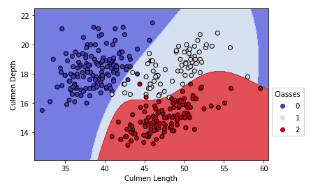

# Julia Andronowitz

## Honors Thesis: Classification Methods for Support Vector Machines

### Spring 2023

This will be the repository for my Honors Thesis on Support Vector Machines. The paper as well as the figures, references, and code used will be uploaded. This thesis is due at the end of Spring Semester, 2023. 

